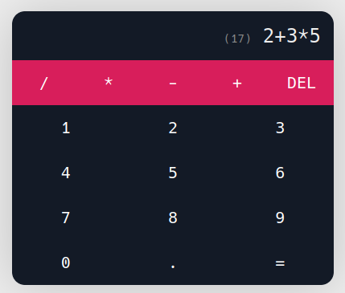
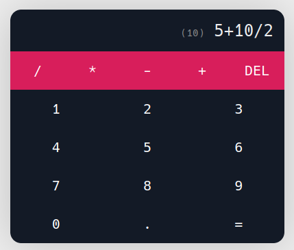

# calc

> A simple Calculator Web App using React JS.

  

 

## Screenshots

 

## Features

- addition
- subtraction
- multiplication
- division

 

## Technologies
  
- HTML
- CSS
- React JS

 

## Contributing

Contributions, issues and feature requests are welcome!

- Star the project
- Find and report issues
- Submit PRs to help solve issues or add features

 

## Author

**Hamza Yehia** 
* Email: hamzayehiamakhlouf@gmail.com
* GitHub: [@HamzaYehia](https://github.com/HamzaYehia)
* LinkedIn: [@HamzaYehia](https://linkedin.com/in/HamzaYehia)
